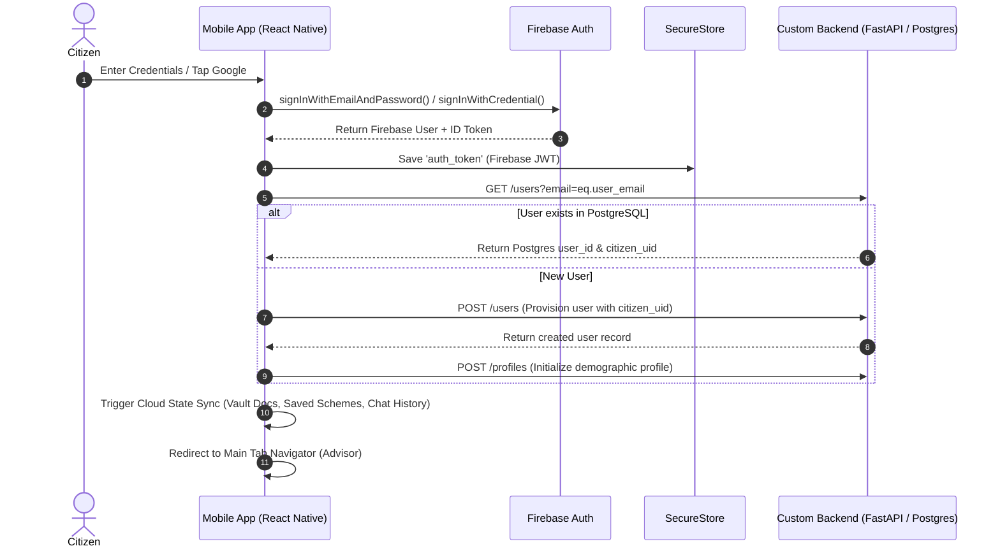

# 📱 Scheme Navigator Mobile — Complete Architecture Guide & Technical Playbook

> **Single Source of Truth**: This guide reflects the **actual running source code** under `mobile/src/`. All descriptions, flows, and directory breakdowns are audited directly against the current codebase.

---

## 🛠️ 1. Core Technology Stack

| Layer | Technology / Library | Purpose |
| --- | --- | --- |
| **Framework** | **Expo v54** + **React Native 0.81** | Modern, cross-platform native runtime with New Architecture support |
| **Routing** | **Expo Router v6** | File-based typed routing (`src/app/`) with nested tab & stack navigators |
| **State Management** | **Zustand v5** | Lightweight, reactive, modular state stores per feature domain |
| **Data Fetching** | **TanStack React Query v5** | Server state caching, infinite scroll pagination, and cloud delta sync |
| **Authentication** | **Firebase Auth** + **PostgreSQL Cloud Sync** | Hybrid auth: Firebase handles credentials; FastAPI/PostgreSQL stores citizen profiles |
| **Local Storage** | **MMKV** & **Expo SecureStore** | High-performance synchronous key-value storage (`mmkv.ts`) & encrypted keychain (`secureStorage.ts`) |
| **Styling & Theme** | Native StyleSheet + Custom Design Tokens | Centralized palette, spacing, typography (`src/core/theme/`) |
| **Validation** | **Zod** | Schema validation for forms, environment configuration, and API payloads |

---

## 📁 2. Repository Layout & Anatomy

```text
mobile/
├── app.json                       # Expo configuration & build settings
├── package.json                   # Dependencies (Expo 54, React Native 0.81, Zustand, TanStack Query)
└── src/
    ├── app/                       # Expo Router file-based screens & navigation
    │   ├── (tabs)/                # Main Bottom Tab Navigator (Advisor, Vault, Check, Schemes)
    │   │   ├── _layout.tsx        # Tab configuration, auth guard redirect & tab reset listeners
    │   │   ├── index.tsx          # Tab 1: AI Advisor (Chat)
    │   │   ├── vault.tsx          # Tab 2: Document Vault & Scheme Readiness
    │   │   ├── check.tsx          # Tab 3: Eligibility Wizard Flow
    │   │   └── schemes.tsx        # Tab 4: Schemes Catalog & Saved Schemes
    │   ├── profile/               # Profile & Account Management Stack
    │   │   ├── index.tsx          # Profile Overview
    │   │   ├── edit.tsx           # Edit Personal Information
    │   │   ├── settings.tsx       # Settings, Language & Change Password
    │   │   └── linked-accounts.tsx# Linked Auth Accounts (Google, Email, Phone)
    │   ├── support/               # Help & Support Center Stack
    │   │   ├── index.tsx          # FAQ Accordion & Category Search
    │   │   └── contact.tsx        # Contact Channels & Support Ticket Form
    │   ├── schemes/               # Scheme Details Stack
    │   │   └── [id].tsx           # Canonical Scheme Details Screen
    │   ├── _layout.tsx            # Root Stack Navigator & Query Provider wrapper
    │   ├── auth.tsx               # Auth Screen (Login / Sign Up)
    │   ├── onboarding.tsx         # Onboarding & Language Selection Screen
    │   └── modal.tsx              # Reusable System Modal wrapper
    │
    ├── core/                      # Shared System Infrastructure
    │   ├── api/                   # HTTP Client, Firebase initialization & Entity Mappers
    │   │   ├── client.ts          # Core API base exports
    │   │   ├── entityMappers.ts   # Pure functions mapping raw DB payloads to typed domain entities
    │   │   ├── firebase.ts        # Firebase Auth SDK initialization
    │   │   └── httpClient.ts      # Traced fetch client with Bearer auth headers & Result<T, AppError>
    │   ├── components/            # Shared UI Primitives (Button, Card, Badge, Input, Toast, TopBar, FeatureGate)
    │   ├── config/                # Zod-validated environment config & feature flags
    │   ├── database/              # Local SQLite/MMKV cache helpers
    │   ├── errors/                # Unified AppError, ErrorBoundary & Result<T, E> error handling
    │   ├── events/                # Event bus (e.g. authSessionExpired event emitter)
    │   ├── storage/               # MMKV (`mmkv.ts`), SecureStore (`secureStorage.ts`), Cloudinary (`cloudinary.ts`)
    │   └── theme/                 # Design tokens (colors, spacing, typography, shadows)
    │
    └── features/                  # Domain-Driven Self-Contained Feature Modules
        ├── advisor/               # Conversational AI Assistant module
        ├── auth/                  # Citizen Authentication & Profile Sync module
        ├── check/                 # Deterministic Eligibility Wizard engine module
        ├── onboarding/            # Splash screen & Multilingual onboarding module
        ├── profile/               # Citizen Demographic Profile & Settings module
        ├── schemes/               # Welfare Schemes Catalog & Bookmarking module
        ├── support/               # FAQ Accordion & Citizen Support module
        └── vault/                 # Encrypted S3 Document Vault & Scheme Readiness module
```

---

## 🔐 3. Authentication Architecture (Hybrid Hybrid Flow)

The mobile client uses a **Hybrid Firebase + Custom PostgreSQL Architecture**:



### Key Technical Details:
1. **Primary Identity**: Firebase Authentication handles password hashing and social login (Google).
2. **Backend Sync (`syncUserToPostgres`)**: Once Firebase authenticates the user, `AuthApiRepository` looks up or provisions the citizen in PostgreSQL (`users` and `profiles` tables).
3. **JWT Injection**: `httpClient.ts` automatically attaches the token to every outgoing request header:
   ```typescript
   Authorization: Bearer <auth_token>
   ```
4. **Resilience & Fallbacks**: If Firebase or the backend network is unreachable during development, `auth.api.ts` gracefully generates a local session token (`local_token_...`), allowing offline usage without crashing.

---

## 🌐 4. Data Fetching & HTTP Client (`core/api/httpClient.ts`)

All network communication flows through a centralized `HttpClient` class returning type-safe `Result<T, AppError>` objects:

- **Request ID Tracing**: Attaches `X-Request-ID` to every request for end-to-end telemetry.
- **Timeout Management**: 10-second default timeout enforced via `AbortController`.
- **Automatic Auth Injection**: Reads `auth_token` from `secureStorage` and appends `Authorization: Bearer <token>`.
- **401 Handling**: Emits `authSessionExpired` on HTTP 401 response, triggering the navigation layout to clear local session and redirect to `/auth`.

---

## 🧩 5. Feature Domain Modules

### 1. AI Advisor (`features/advisor/`)
- **AdvisorScreen**: Main chat timeline with multi-turn conversation support.
- **ChatInputBar**: Text input bar with voice dictation trigger.
- **VoiceListeningModal**: Hands-free voice speech-to-text overlay modal.
- **Components**: `MessageBubble`, `PromptChips`, `SchemeRecommendationCard`, `ThinkingIndicator`, `WelcomeCard`, `ChatHistoryDrawer`.
- **State (`useAdvisorStore`)**: Manages current session messages, streaming state, prompt chips, and history drawer toggle.

### 2. Document Vault (`features/vault/`)
- **VaultHomeScreen**: Grid/list of encrypted vault documents with category badges (`identity`, `income`, `land`, `bank`, `other`).
- **SchemeReadinessScreen**: Evaluates document readiness against a selected target welfare scheme, giving a percentage score (e.g., `100% Ready` or `66.7% Ready`) and highlighting missing certificates.
- **Components**: `UploadDocSheet`, `VaultDocumentCard`, `ReadinessMeter`, `RequiredDocsList`, `DocumentSavedModal`.

### 3. Eligibility Check Wizard (`features/check/`)
- **CheckFlowScreens**: Step-by-step quiz wizard guiding citizens through:
  - Step 1: Demographics (Age, Gender, State, District from `indiaLocations.ts`)
  - Step 2: Economics (Income slider, Income presets, Caste category)
  - Step 3: Profession & Assets (Occupation, Land ownership, Disability flag)
  - Step 4: Results & Matches (Fully Eligible vs Nearly Eligible recommendations)
- **Local Engine (`local-eligibility-engine.ts`)**: Evaluates rules client-side instantly for offline speed, with backend sync to `/eligibility/explain`.

### 4. Schemes Catalog (`features/schemes/`)
- **SchemesScreen**: Primary welfare discovery hub with two segment tabs:
  - **Explore Schemes**: Live infinite-scroll catalog with search, category filters, and state jurisdiction filters.
  - **Saved Schemes**: Instant view of bookmarked schemes saved to the user's profile.
- **Delta Sync (`useCatalogVersionQuery`)**: Compares local catalog version against backend and performs incremental delta syncs when updates occur.

### 5. Profile & Settings (`features/profile/`)
- **ProfileScreen**: Overview of citizen identity, sovereign `citizen_uid`, and menu cards.
- **SettingsScreen**: Manage language preferences, notifications toggle, security channel, and Change Password modal.
- **Modals**: `ChangePasswordModal`, `DeleteAccountModal`, `LinkAccountModal`, `LogoutConfirmModal`.

### 6. Help & Support (`features/support/`)
- **HelpSupportScreen**: Category-filtered FAQ accordion (`Account`, `Schemes`, `Documents`) with search.
- **ContactSupportScreen**: Support ticket submission form with direct contact channels.

---

## 📱 6. Navigation Summary & Screen Inventory

### Main Tabs Navigator (`app/(tabs)/_layout.tsx`)
1. **Advisor** (`/`): AI Chat Consultant
2. **Vault** (`/(tabs)/vault`): Document Manager & Application Readiness
3. **Check** (`/(tabs)/check`): Scheme Eligibility Quiz
4. **Schemes** (`/(tabs)/schemes`): Search, Browse & Saved Schemes

### Shared Stack Routes
- `/profile`: Profile Overview
- `/profile/edit`: Edit Demographic Information
- `/profile/settings`: System Settings & Password Change
- `/profile/linked-accounts`: Social Account Linking
- `/support`: Help Center & FAQ Accordion
- `/support/contact`: Contact Support Form
- `/schemes/[id]`: Canonical Scheme Details Screen
- `/auth`: Login & Signup Screen
- `/onboarding`: Splash Screen & Language Selector (`en` / `hi`)

---

## ⚡ 7. Verification & Build Commands

```bash
# Run unit tests across all feature modules
pnpm test

# Type check TypeScript files
npx tsc --noEmit

# Start Metro dev server
pnpm start
```
